# 큐레이션 선택 플로우 전체 맵

큐레이션 엔진(`curationEngine.ts`)의 모든 선택 경로와 결과를 정리한 문서.

총 **6개 페르소나 × 3×3 조합 = 54개 경로**.

---

## 플랜 추천 기준

| 추천 의도 (intent) | 플랜 우선순위 |
| --- | --- |
| `basic` | 베이직 → 스탠다드 → 프리미엄 |
| `feedback` | 스탠다드 → 프리미엄 → 베이직 |
| `intensive` | 프리미엄 → 스탠다드 → 베이직 |

프로그램에 해당 플랜이 없으면 다음 우선순위로 넘어간다.

---

## 페르소나 1: `starter` — 취준 입문 · 경험 정리가 먼저

> Step 1: "지금 가장 시급한 과제는 무엇인가요?"
> Step 2: "이번 1~2주 투자 가능 시간과 피드백 니즈는?"

### Step 1: `needs-resume` — 1주 안에 이력서 제출

**헤드라인:** 이번 주 안에 제출해야 한다면, 이력서 → 자소서 순서로
**요약:** 이력서를 1주 안에 완성하고, 여유가 되는 대로 자소서를 병행하세요. 경험 소재가 부족하다면 경험정리 챌린지를 짧게 끼워 넣어도 좋습니다.

| Step 2 선택 | Primary 추천 | Secondary 추천 |
| --- | --- | --- |
| `time-tight` — 주 3~5시간, 빠른 가이드 선호 | 이력서 1주 완성 (basic) | 자기소개서 2주 완성 (basic) |
| `need-feedback` — 멘토 피드백 1~2회 | 이력서 1주 완성 (feedback) | 자기소개서 2주 완성 (basic) |
| `need-portfolio` — 직무 자료/포트폴리오까지 | 이력서 1주 완성 (basic) | 자기소개서 2주 완성 (basic) |

---

### Step 1: `needs-bundle` — 서류 전체를 한 번에 정비

**헤드라인:** 서류 전체를 정비하고 싶다면 자소서 → 포트폴리오 순서로
**요약:** 자소서 핵심 문항을 먼저 완성하고, 직무 사례가 필요하면 포트폴리오 챌린지를 바로 이어가세요.

| Step 2 선택 | Primary 추천 | Secondary 추천 |
| --- | --- | --- |
| `time-tight` — 주 3~5시간, 빠른 가이드 선호 | 자기소개서 2주 완성 (basic) | 포트폴리오 2주 완성 (basic) |
| `need-feedback` — 멘토 피드백 1~2회 | 자기소개서 2주 완성 (feedback) | 포트폴리오 2주 완성 (basic) |
| `need-portfolio` — 직무 자료/포트폴리오까지 | 자기소개서 2주 완성 (basic) | 포트폴리오 2주 완성 (feedback) |

---

### Step 1: `needs-experience` — 경험 소재부터 만들기

**헤드라인:** 경험 소재부터 쌓고, 이력서로 이어가기
**요약:** 경험 소재가 부족하다면 2주 동안 STAR 기반으로 정리한 뒤, 1주 차에 이력서를 완성하세요.

| Step 2 선택 | Primary 추천 | Secondary 추천 |
| --- | --- | --- |
| `time-tight` — 주 3~5시간, 빠른 가이드 선호 | 기필코 경험정리 (basic) | 이력서 1주 완성 (basic) |
| `need-feedback` — 멘토 피드백 1~2회 | 기필코 경험정리 (feedback) | 이력서 1주 완성 (feedback) |
| `need-portfolio` — 직무 자료/포트폴리오까지 | 기필코 경험정리 (basic) | 이력서 1주 완성 (feedback) |

---

## 페르소나 2: `resume` — 이력서부터 빠르게 완성

> Step 1: "이력서 작성 배경을 골라주세요."
> Step 2: "지원 일정은 얼마나 촉박한가요?"

### Step 1: `first-resume` — 첫 이력서라 소재가 부족해요

| Step 2 선택 | 헤드라인 | Primary 추천 | Secondary 추천 |
| --- | --- | --- | --- |
| `deadline-soon` — 이번 주 안에 제출 | 이번 주 안에 제출: 이력서 단일 집중 | 이력서 1주 완성 (basic) | 기필코 경험정리 (basic) |
| `deadline-few-weeks` — 2~3주 안에 제출 | 여유가 있다면 경험정리 또는 자소서를 곁들이기 | 이력서 1주 완성 (feedback) | 기필코 경험정리 (basic) |
| `deadline-flex` — 한 달 이상 여유 | 여유가 있다면 경험정리 또는 자소서를 곁들이기 | 이력서 1주 완성 (feedback) | 기필코 경험정리 (basic) |

**요약 (공통):** 마감이 임박하면 이력서만 완성하고, 여유가 있으면 경험정리나 자소서를 병행해 완성도를 높이세요.

---

### Step 1: `refresh` — 기존 이력서를 업데이트하려고 해요

| Step 2 선택 | 헤드라인 | Primary 추천 | Secondary 추천 |
| --- | --- | --- | --- |
| `deadline-soon` — 이번 주 안에 제출 | 이번 주 안에 제출: 이력서 단일 집중 | 이력서 1주 완성 (basic) | — |
| `deadline-few-weeks` — 2~3주 안에 제출 | 여유가 있다면 경험정리 또는 자소서를 곁들이기 | 이력서 1주 완성 (feedback) | — |
| `deadline-flex` — 한 달 이상 여유 | 여유가 있다면 경험정리 또는 자소서를 곁들이기 | 이력서 1주 완성 (feedback) | — |

---

### Step 1: `career-shift` — 직무/산업 전환을 준비 중이에요

| Step 2 선택 | 헤드라인 | Primary 추천 | Secondary 추천 |
| --- | --- | --- | --- |
| `deadline-soon` — 이번 주 안에 제출 | 이번 주 안에 제출: 이력서 단일 집중 | 이력서 1주 완성 (basic) | 자기소개서 2주 완성 (feedback) |
| `deadline-few-weeks` — 2~3주 안에 제출 | 여유가 있다면 경험정리 또는 자소서를 곁들이기 | 이력서 1주 완성 (feedback) | 자기소개서 2주 완성 (feedback) |
| `deadline-flex` — 한 달 이상 여유 | 여유가 있다면 경험정리 또는 자소서를 곁들이기 | 이력서 1주 완성 (feedback) | 자기소개서 2주 완성 (feedback) |

---

## 페르소나 3: `coverLetter` — 자기소개서/지원동기 강화

> Step 1: "어떤 자기소개서를 준비 중인가요?"
> Step 2: "피드백 강도를 선택해주세요."

### Step 1: `enterprise-cover` — 대기업/공채용 자소서

**헤드라인:** 공채 문항 대비는 대기업 자소서 트랙으로
**요약:** 산업/기업 분석과 문항별 멘토링이 포함된 트랙이 필요합니다.

| Step 2 선택 | Primary 추천 | Secondary 추천 |
| --- | --- | --- |
| `light-feedback` — 가이드만 있어도 충분 | 대기업 자기소개서 (feedback) | — |
| `needs-iteration` — 1~2회 피드백으로 완성 | 대기업 자기소개서 (feedback) | — |
| `needs-intensive` — 문항별 심화/라이브 피드백 | 대기업 자기소개서 (intensive) | — |

---

### Step 1: `general-cover` — 직무 기본 자소서

**헤드라인:** 직무형 자소서는 2주 완성 트랙으로
**요약:** 직무 분석과 스토리라인을 잡은 뒤, 피드백 강도에 맞춰 플랜을 선택하세요.

| Step 2 선택 | Primary 추천 | Secondary 추천 |
| --- | --- | --- |
| `light-feedback` — 가이드만 있어도 충분 | 자기소개서 2주 완성 (basic) | — |
| `needs-iteration` — 1~2회 피드백으로 완성 | 자기소개서 2주 완성 (feedback) | — |
| `needs-intensive` — 문항별 심화/라이브 피드백 | 자기소개서 2주 완성 (intensive) | — |

---

### Step 1: `portfolio-linked` — 포트폴리오 연계 자소서

**헤드라인:** 직무형 자소서는 2주 완성 트랙으로
**요약:** 포트폴리오 연계가 필요하면 후속으로 이어가면 됩니다.

| Step 2 선택 | Primary 추천 | Secondary 추천 |
| --- | --- | --- |
| `light-feedback` — 가이드만 있어도 충분 | 자기소개서 2주 완성 (basic) | 포트폴리오 2주 완성 (basic) |
| `needs-iteration` — 1~2회 피드백으로 완성 | 자기소개서 2주 완성 (feedback) | 포트폴리오 2주 완성 (basic) |
| `needs-intensive` — 문항별 심화/라이브 피드백 | 자기소개서 2주 완성 (intensive) | 포트폴리오 2주 완성 (feedback) |

---

## 페르소나 4: `portfolio` — 포트폴리오/직무 자료 준비

> Step 1: "포트폴리오가 필요한 목적은 무엇인가요?"
> Step 2: "현재 준비 상태는 어떤가요?"

**헤드라인 (공통):** 직무 사례를 입증할 포트폴리오 설계
**요약 (공통):** 포트폴리오를 핵심 근거로 삼고 싶다면 직무 트랙을 선택하세요. 초안이 있다면 구조화에 집중하고, 없다면 템플릿과 예시를 활용해 빠르게 골격을 세우면 됩니다.

### Step 1: `portfolio-core` — 직무 포트폴리오만 빠르게 완성

| Step 2 선택 | Primary 추천 | Secondary 추천 |
| --- | --- | --- |
| `has-drafts` — 초안은 있고 구조화만 필요 | 포트폴리오 2주 완성 (basic) | — |
| `need-templates` — 템플릿과 예시가 필요 | 포트폴리오 2주 완성 (feedback) | 자기소개서 2주 완성 (basic) |
| `need-feedback` — 포트폴리오 피드백을 받고 싶어요 | 포트폴리오 2주 완성 (feedback) | — |

> `need-templates` 선택 시에만 자기소개서 Secondary 추가됨

---

### Step 1: `marketing-track` — 마케팅 직무용 포폴과 서류

| Step 2 선택 | Primary 추천 | Secondary 추천 |
| --- | --- | --- |
| `has-drafts` — 초안은 있고 구조화만 필요 | 마케팅 올인원 (basic) | — |
| `need-templates` — 템플릿과 예시가 필요 | 마케팅 올인원 (feedback) | — |
| `need-feedback` — 포트폴리오 피드백을 받고 싶어요 | 마케팅 올인원 (feedback) | — |

---

### Step 1: `hr-track` — HR 직무용 포폴과 서류

| Step 2 선택 | Primary 추천 | Secondary 추천 |
| --- | --- | --- |
| `has-drafts` — 초안은 있고 구조화만 필요 | HR 올인원 (basic) | — |
| `need-templates` — 템플릿과 예시가 필요 | HR 올인원 (feedback) | — |
| `need-feedback` — 포트폴리오 피드백을 받고 싶어요 | HR 올인원 (feedback) | — |

---

## 페르소나 5: `specialized` — 특화 트랙(대기업·마케팅·HR)

> Step 1: "특화 트랙을 선택해주세요."
> Step 2: "현재 준비 상태는 어떤가요?"

**헤드라인 (공통):** 특화 트랙에 집중하고, 필요한 만큼 소재를 보강
**요약 (공통):** 현직자 특강과 심화 피드백이 포함된 트랙을 중심으로 진행하세요. 소재가 부족하면 경험정리를 짧게 추가해 흐름을 잡아두면 좋습니다.

### Step 1: `enterprise` — 대기업 공채 대비

| Step 2 선택 | Primary 추천 | Secondary 추천 |
| --- | --- | --- |
| `need-experience` — 경험 소재부터 다시 정리 | 대기업 자기소개서 (basic) | 기필코 경험정리 (basic) |
| `need-feedback` — 피드백을 많이 받고 싶어요 | 대기업 자기소개서 (intensive) | — |
| `ready-to-run` — 바로 작성/제출 준비 | 대기업 자기소개서 (feedback) | — |

---

### Step 1: `marketing` — 마케팅 올인원 트랙

| Step 2 선택 | Primary 추천 | Secondary 추천 |
| --- | --- | --- |
| `need-experience` — 경험 소재부터 다시 정리 | 마케팅 올인원 (basic) | 기필코 경험정리 (basic) |
| `need-feedback` — 피드백을 많이 받고 싶어요 | 마케팅 올인원 (intensive) | — |
| `ready-to-run` — 바로 작성/제출 준비 | 마케팅 올인원 (feedback) | — |

---

### Step 1: `hr` — HR 올인원 트랙

| Step 2 선택 | Primary 추천 | Secondary 추천 |
| --- | --- | --- |
| `need-experience` — 경험 소재부터 다시 정리 | HR 올인원 (basic) | 기필코 경험정리 (basic) |
| `need-feedback` — 피드백을 많이 받고 싶어요 | HR 올인원 (intensive) | — |
| `ready-to-run` — 바로 작성/제출 준비 | HR 올인원 (feedback) | — |

---

## 페르소나 6: `dontKnow` — 잘 모르겠어요

> Step 1: "현재 취업 준비 단계를 알려주세요."
> Step 2: "가장 고민되는 부분은 무엇인가요?"

### Step 1: `just-started` — 막 시작했어요

| Step 2 선택 | 헤드라인 | Primary 추천 | Secondary 추천 |
| --- | --- | --- | --- |
| `dont-know-what` — 무엇부터 시작할지 모르겠어요 | 경험정리부터 시작해서 흐름을 잡으세요 | 기필코 경험정리 (basic) | 이력서 1주 완성 (basic) |
| `lack-time` — 시간이 부족해요 | 시간이 부족하다면 이력서 1주 완성부터 | 이력서 1주 완성 (basic) | 자기소개서 2주 완성 (basic) |
| `quality-concern` — 작성 내용 품질이 걱정돼요 | 경험정리 후 피드백과 함께 서류 완성 | 기필코 경험정리 (basic) | 이력서 1주 완성 (feedback) |

**요약:**
- `dont-know-what`: 취준을 막 시작했다면 경험정리로 소재를 확보한 후 이력서로 이어가는 것이 가장 안전합니다.
- `lack-time`: 빠르게 서류를 준비해야 한다면 이력서 1주 완성으로 시작하고, 여유가 생기면 자소서를 보완하세요.
- `quality-concern`: 품질이 걱정된다면 피드백이 포함된 플랜으로 경험정리와 이력서를 차근차근 준비하세요.

---

### Step 1: `working-on-docs` — 서류를 작성하고 있어요

| Step 2 선택 | 헤드라인 | Primary 추천 | Secondary 추천 |
| --- | --- | --- | --- |
| `dont-know-what` — 무엇부터 시작할지 모르겠어요 | 자소서 챌린지로 서류를 고도화하세요 | 자기소개서 2주 완성 (basic) | 이력서 1주 완성 (basic) |
| `lack-time` — 시간이 부족해요 | 시간이 부족하다면 이력서 집중 완성 | 이력서 1주 완성 (basic) | 자기소개서 2주 완성 (basic) |
| `quality-concern` — 작성 내용 품질이 걱정돼요 | 품질이 걱정되면 피드백 플랜을 선택하세요 | 자기소개서 2주 완성 (feedback) | 포트폴리오 2주 완성 (basic) |

**요약:**
- `dont-know-what`: 서류를 작성 중이라면 자소서 챌린지로 직무 역량과 지원동기를 탄탄하게 만드세요.
- `lack-time`: 서류를 작성 중이지만 시간이 부족하다면 이력서를 먼저 마무리하고, 자소서는 후순위로 미루세요.
- `quality-concern`: 작성한 내용이 걱정된다면 자소서 챌린지로 직무 분석과 스토리를 보강하고 피드백을 받으세요.

---

### Step 1: `almost-ready` — 거의 완성했어요

| Step 2 선택 | 헤드라인 | Primary 추천 | Secondary 추천 |
| --- | --- | --- | --- |
| `dont-know-what` — 무엇부터 시작할지 모르겠어요 | 포트폴리오나 특화 트랙으로 차별화하세요 | 포트폴리오 2주 완성 (basic) | 대기업 자기소개서 (basic) |
| `lack-time` — 시간이 부족해요 | 포트폴리오나 특화 트랙으로 차별화하세요 | 포트폴리오 2주 완성 (basic) | 대기업 자기소개서 (basic) |
| `quality-concern` — 작성 내용 품질이 걱정돼요 | 마지막 점검은 피드백 리포트로 | 자기소개서 2주 완성 (basic¹) | 포트폴리오 2주 완성 (basic) |

**요약:**
- `dont-know-what` / `lack-time`: 서류가 거의 완성되었다면 포트폴리오로 직무 사례를 보강하거나, 대기업·마케팅·HR 특화 트랙을 고려해보세요.
- `quality-concern`: 서류가 거의 완성되었다면 빠른 피드백으로 최종 점검을 받으세요. 포트폴리오가 필요하면 추가 준비하세요.

> ¹ `almost-ready + quality-concern`의 자기소개서 플랜은 `pickPlan('coverLetter', 'standard')` 호출로 인해 `planPriorityByIntent`에 정의되지 않은 의도가 전달됨. 런타임에서는 `available[0]` (첫 번째 플랜) 으로 폴백 처리됨. 잠재적 버그.

---

---

## Mermaid 플로우 다이어그램

> **플랜 범례** — B: 베이직(basic) · S: 스탠다드(feedback) · P: 프리미엄(intensive)
> 결과 노드: `✅ Primary / ➕ Secondary`

```mermaid
flowchart LR
    START([큐레이션 시작]) --> PER{페르소나 선택}

    PER --> ST(["① starter\n취준 입문"])
    PER --> RS(["② resume\n이력서 완성"])
    PER --> CL(["③ coverLetter\n자소서 강화"])
    PER --> PO(["④ portfolio\n포트폴리오"])
    PER --> SP(["⑤ specialized\n특화 트랙"])
    PER --> DK(["⑥ dontKnow\n잘 모르겠어요"])

    %% ──────────────────────────────────────
    %% ① starter
    %% ──────────────────────────────────────
    subgraph SG_ST ["① starter — 취준 입문 · 경험 정리"]
        direction LR
        ST_1["needs-resume\n1주 안에 이력서"]
        ST_2["needs-bundle\n서류 전체 정비"]
        ST_3["needs-experience\n경험 소재부터"]

        ST_1 --time-tight-->     ST_1a["✅ 이력서(B)\n➕ 자소서(B)"]
        ST_1 --need-feedback-->  ST_1b["✅ 이력서(S)\n➕ 자소서(B)"]
        ST_1 --need-portfolio--> ST_1c["✅ 이력서(B)\n➕ 자소서(B)"]

        ST_2 --time-tight-->     ST_2a["✅ 자소서(B)\n➕ 포폴(B)"]
        ST_2 --need-feedback-->  ST_2b["✅ 자소서(S)\n➕ 포폴(B)"]
        ST_2 --need-portfolio--> ST_2c["✅ 자소서(B)\n➕ 포폴(S)"]

        ST_3 --time-tight-->     ST_3a["✅ 경험정리(B)\n➕ 이력서(B)"]
        ST_3 --need-feedback-->  ST_3b["✅ 경험정리(S)\n➕ 이력서(S)"]
        ST_3 --need-portfolio--> ST_3c["✅ 경험정리(B)\n➕ 이력서(S)"]
    end

    ST --> ST_1 & ST_2 & ST_3

    %% ──────────────────────────────────────
    %% ② resume
    %% ──────────────────────────────────────
    subgraph SG_RS ["② resume — 이력서 빠르게 완성"]
        direction LR
        RS_1["first-resume\n첫 이력서"]
        RS_2["refresh\n이력서 업데이트"]
        RS_3["career-shift\n직무 전환"]

        RS_1 --deadline-soon-->       RS_1a["✅ 이력서(B)\n➕ 경험정리(B)"]
        RS_1 --deadline-few-weeks-->  RS_1b["✅ 이력서(S)\n➕ 경험정리(B)"]
        RS_1 --deadline-flex-->       RS_1c["✅ 이력서(S)\n➕ 경험정리(B)"]

        RS_2 --deadline-soon-->       RS_2a["✅ 이력서(B)"]
        RS_2 --deadline-few-weeks-->  RS_2b["✅ 이력서(S)"]
        RS_2 --deadline-flex-->       RS_2c["✅ 이력서(S)"]

        RS_3 --deadline-soon-->       RS_3a["✅ 이력서(B)\n➕ 자소서(S)"]
        RS_3 --deadline-few-weeks-->  RS_3b["✅ 이력서(S)\n➕ 자소서(S)"]
        RS_3 --deadline-flex-->       RS_3c["✅ 이력서(S)\n➕ 자소서(S)"]
    end

    RS --> RS_1 & RS_2 & RS_3

    %% ──────────────────────────────────────
    %% ③ coverLetter
    %% ──────────────────────────────────────
    subgraph SG_CL ["③ coverLetter — 자기소개서 강화"]
        direction LR
        CL_1["enterprise-cover\n대기업 공채"]
        CL_2["general-cover\n직무 기본 자소서"]
        CL_3["portfolio-linked\n포폴 연계 자소서"]

        CL_1 --light-feedback-->    CL_1a["✅ 대기업(S)"]
        CL_1 --needs-iteration-->   CL_1b["✅ 대기업(S)"]
        CL_1 --needs-intensive-->   CL_1c["✅ 대기업(P)"]

        CL_2 --light-feedback-->    CL_2a["✅ 자소서(B)"]
        CL_2 --needs-iteration-->   CL_2b["✅ 자소서(S)"]
        CL_2 --needs-intensive-->   CL_2c["✅ 자소서(P)"]

        CL_3 --light-feedback-->    CL_3a["✅ 자소서(B)\n➕ 포폴(B)"]
        CL_3 --needs-iteration-->   CL_3b["✅ 자소서(S)\n➕ 포폴(B)"]
        CL_3 --needs-intensive-->   CL_3c["✅ 자소서(P)\n➕ 포폴(S)"]
    end

    CL --> CL_1 & CL_2 & CL_3

    %% ──────────────────────────────────────
    %% ④ portfolio
    %% ──────────────────────────────────────
    subgraph SG_PO ["④ portfolio — 포트폴리오 · 직무 자료"]
        direction LR
        PO_1["portfolio-core\n직무 포폴만 완성"]
        PO_2["marketing-track\n마케팅 직무"]
        PO_3["hr-track\nHR 직무"]

        PO_1 --has-drafts-->     PO_1a["✅ 포폴(B)"]
        PO_1 --need-templates--> PO_1b["✅ 포폴(S)\n➕ 자소서(B)"]
        PO_1 --need-feedback-->  PO_1c["✅ 포폴(S)"]

        PO_2 --has-drafts-->     PO_2a["✅ 마케팅올인원(B)"]
        PO_2 --need-templates--> PO_2b["✅ 마케팅올인원(S)"]
        PO_2 --need-feedback-->  PO_2c["✅ 마케팅올인원(S)"]

        PO_3 --has-drafts-->     PO_3a["✅ HR올인원(B)"]
        PO_3 --need-templates--> PO_3b["✅ HR올인원(S)"]
        PO_3 --need-feedback-->  PO_3c["✅ HR올인원(S)"]
    end

    PO --> PO_1 & PO_2 & PO_3

    %% ──────────────────────────────────────
    %% ⑤ specialized
    %% ──────────────────────────────────────
    subgraph SG_SP ["⑤ specialized — 특화 트랙"]
        direction LR
        SP_1["enterprise\n대기업 공채"]
        SP_2["marketing\n마케팅 올인원"]
        SP_3["hr\nHR 올인원"]

        SP_1 --need-experience--> SP_1a["✅ 대기업(B)\n➕ 경험정리(B)"]
        SP_1 --need-feedback-->   SP_1b["✅ 대기업(P)"]
        SP_1 --ready-to-run-->    SP_1c["✅ 대기업(S)"]

        SP_2 --need-experience--> SP_2a["✅ 마케팅올인원(B)\n➕ 경험정리(B)"]
        SP_2 --need-feedback-->   SP_2b["✅ 마케팅올인원(P)"]
        SP_2 --ready-to-run-->    SP_2c["✅ 마케팅올인원(S)"]

        SP_3 --need-experience--> SP_3a["✅ HR올인원(B)\n➕ 경험정리(B)"]
        SP_3 --need-feedback-->   SP_3b["✅ HR올인원(P)"]
        SP_3 --ready-to-run-->    SP_3c["✅ HR올인원(S)"]
    end

    SP --> SP_1 & SP_2 & SP_3

    %% ──────────────────────────────────────
    %% ⑥ dontKnow
    %% ──────────────────────────────────────
    subgraph SG_DK ["⑥ dontKnow — 잘 모르겠어요"]
        direction LR
        DK_1["just-started\n막 시작했어요"]
        DK_2["working-on-docs\n서류 작성 중"]
        DK_3["almost-ready\n거의 완성"]

        DK_1 --dont-know-what-->   DK_1a["✅ 경험정리(B)\n➕ 이력서(B)"]
        DK_1 --lack-time-->        DK_1b["✅ 이력서(B)\n➕ 자소서(B)"]
        DK_1 --quality-concern-->  DK_1c["✅ 경험정리(B)\n➕ 이력서(S)"]

        DK_2 --dont-know-what-->   DK_2a["✅ 자소서(B)\n➕ 이력서(B)"]
        DK_2 --lack-time-->        DK_2b["✅ 이력서(B)\n➕ 자소서(B)"]
        DK_2 --quality-concern-->  DK_2c["✅ 자소서(S)\n➕ 포폴(B)"]

        DK_3 --dont-know-what-->   DK_3a["✅ 포폴(B)\n➕ 대기업(B)"]
        DK_3 --lack-time-->        DK_3b["✅ 포폴(B)\n➕ 대기업(B)"]
        DK_3 --quality-concern-->  DK_3c["✅ 자소서(B⚠️)\n➕ 포폴(B)"]
    end

    DK --> DK_1 & DK_2 & DK_3

    %% ──────────────────────────────────────
    %% 스타일
    %% ──────────────────────────────────────
    classDef persona  fill:#e0e7ff,stroke:#6366f1,color:#1e1b4b,font-weight:bold
    classDef step1    fill:#f1f5f9,stroke:#94a3b8,color:#1e293b
    classDef result   fill:#f0fdf4,stroke:#22c55e,color:#14532d
    classDef warn     fill:#fef9c3,stroke:#ca8a04,color:#713f12

    class ST,RS,CL,PO,SP,DK persona
    class ST_1,ST_2,ST_3 step1
    class RS_1,RS_2,RS_3 step1
    class CL_1,CL_2,CL_3 step1
    class PO_1,PO_2,PO_3 step1
    class SP_1,SP_2,SP_3 step1
    class DK_1,DK_2,DK_3 step1
    class ST_1a,ST_1b,ST_1c,ST_2a,ST_2b,ST_2c,ST_3a,ST_3b,ST_3c result
    class RS_1a,RS_1b,RS_1c,RS_2a,RS_2b,RS_2c,RS_3a,RS_3b,RS_3c result
    class CL_1a,CL_1b,CL_1c,CL_2a,CL_2b,CL_2c,CL_3a,CL_3b,CL_3c result
    class PO_1a,PO_1b,PO_1c,PO_2a,PO_2b,PO_2c,PO_3a,PO_3b,PO_3c result
    class SP_1a,SP_1b,SP_1c,SP_2a,SP_2b,SP_2c,SP_3a,SP_3b,SP_3c result
    class DK_1a,DK_1b,DK_1c,DK_2a,DK_2b,DK_2c,DK_3a,DK_3b result
    class DK_3c warn
```

---

## 전체 추천 프로그램 등장 패턴

| 프로그램 | Primary로 등장하는 경우 | Secondary로 등장하는 경우 |
| --- | --- | --- |
| 기필코 경험정리 | starter/needs-experience, dontKnow/just-started/dont-know-what, dontKnow/just-started/quality-concern | starter/needs-experience, resume/first-resume, specialized/need-experience |
| 이력서 1주 완성 | starter/needs-resume, resume (전체), dontKnow/just-started/lack-time, dontKnow/working-on-docs/lack-time | starter/needs-experience, dontKnow/just-started/dont-know-what, dontKnow/just-started/quality-concern, dontKnow/working-on-docs/dont-know-what |
| 자기소개서 2주 완성 | coverLetter/general-cover, coverLetter/portfolio-linked, dontKnow/working-on-docs/dont-know-what, dontKnow/working-on-docs/quality-concern | starter/needs-resume, starter/needs-bundle, resume/career-shift, dontKnow/just-started/lack-time, dontKnow/working-on-docs/lack-time |
| 포트폴리오 2주 완성 | portfolio/portfolio-core, dontKnow/almost-ready/dont-know-what, dontKnow/almost-ready/lack-time | starter/needs-bundle, coverLetter/portfolio-linked, portfolio/portfolio-core/need-templates, dontKnow/working-on-docs/quality-concern, dontKnow/almost-ready/quality-concern |
| 대기업 자기소개서 | coverLetter/enterprise-cover, specialized/enterprise | dontKnow/almost-ready/dont-know-what, dontKnow/almost-ready/lack-time |
| 마케팅 올인원 | portfolio/marketing-track, specialized/marketing | — |
| HR 올인원 | portfolio/hr-track, specialized/hr | — |
