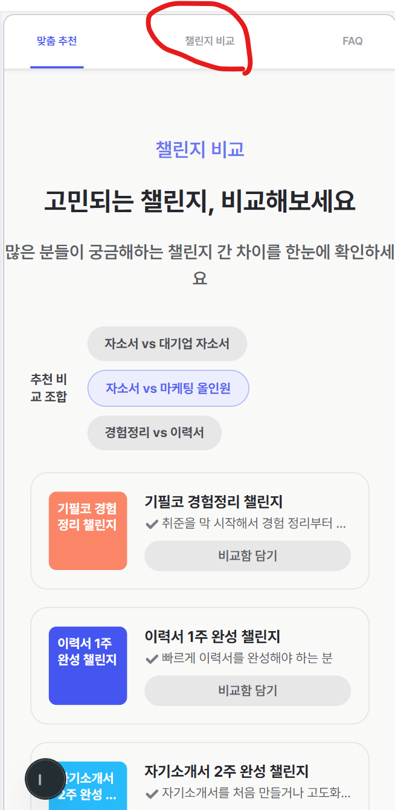
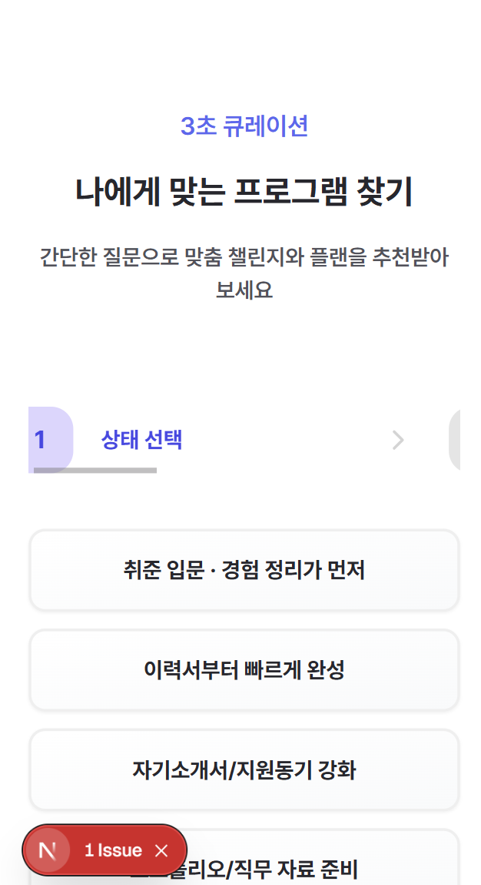

---
done

1. 비교함에 담기 이후 프로그램 2개 담기 버튼이 생김 이 프로그램 2개 비교하기는 FAQ가 보이기 시작하거나 나에게 맞는 프로그램 찾기가 보이면 보이지 않게 해야함
2. 이 프로그램 2개 비교하기를 클릭한 후 비교함으로 돌아가는 버튼을 클릭했을때 비교함에 담기 클릭했던게 모두 풀려야함
3. 챌린지 비교 부분 모바일 ui의 디자인이 기존 피그마 디자인과 많이 다르며 다른 자주묻는 질문과 나에게 맞는 프로그램 부분 디자인이 통일성이 부족함
---

done

1. 모바일에서 좌우 여백이 큐레이션, 첼린지 비교, 자주묻는 질문이 각각 다름
2. 모바일 큐레이션에서는 내가 진행한 정도에 따라서 1 상태선택, 2 오늘 상황 , 3 시간과 일정이 가운데 있도록 자동 스크롤하고 화살표 모양이랑 모바일 ui에 맞게 표시되도록 해줘
3. 모바일에서 추천조합 클릭하고 비교함에 나왔을때 보라색으로 버튼 색이 변경되는거 없에줘
4.  겔럭시 s8+ 360x740 이 사이즈에서 모바일 ui가 이상하게 보여 모바일 반응형을 최적화 해줘
5.  비교함에 들어갔을때 글자가 두줄이 되서 버튼의 위치가 달라지는 버그가 있어 글자를 한줄로 만들든 버튼 위치를 조정하든 해봐

---

done

1. 첼린지 비교를 클릭했을 때  첼린지 비교하기로 파란색 밑줄이 안바뀌는 버그가 있어 개선해
2. 오류를 수정해

```
## Error Type
Runtime Error

## Error Message
Image is not defined


    at eval (src\domain\curation\flow\CurationStepper.tsx:86:18)
    at Array.map (<anonymous>:null:null)
    at CurationStepper (src\domain\curation\flow\CurationStepper.tsx:35:16)

## Code Frame
  84 |               {/* 화살표 */}
  85 |               {!isLast && (
> 86 |                 <Image
     |                  ^
  87 |                   src="/images/curation/tabler_arrow-up.svg"
  88 |                   alt=""
  89 |                   width={24}

Next.js version: 15.5.7 (Webpack)

```

---



1. 모바일이랑 데스크탑 부분 전부 번호를 클릭했을때 이동이 잘안되는 버그가 있어 결과가 나왔을때 전으로 돌아가면 결과가 사라지고 전으로 돌아가서 클릭이 가능해야해
2. 모바일에서 1번 2번 3번 4번이 한번에 보였으면 좋겠어
3. 오류를 수정해

```
## Error Type
Console Error

## Error Message
A tree hydrated but some attributes of the server rendered HTML didn't match the client properties. This won't be patched up. This can happen if a SSR-ed Client Component used:

- A server/client branch `if (typeof window !== 'undefined')`.
- Variable input such as `Date.now()` or `Math.random()` which changes each time it's called.
- Date formatting in a user's locale which doesn't match the server.
- External changing data without sending a snapshot of it along with the HTML.
- Invalid HTML tag nesting.

It can also happen if the client has a browser extension installed which messes with the HTML before React loaded.

https://react.dev/link/hydration-mismatch

  ...
    <LoadingBoundary loading={null}>
      <HTTPAccessFallbackBoundary notFound={undefined} forbidden={undefined} unauthorized={undefined}>
        <RedirectBoundary>
          <RedirectErrorBoundary router={{...}}>
            <InnerLayoutRouter url="/curation" tree={[...]} cacheNode={{lazyData:null, ...}} segmentPath={[...]}>
              <SegmentViewNode type="page" pagePath="(user)/cur...">
                <SegmentTrieNode>
                <Page>
                  <CurationScreen>
                    <main className="flex min-h...">
                      <CurationHero>
                      <CurationStickyNav>
                      <section>
                      <div>
                      <section>
                      <div>
                      <section className="w-full bg-...">
                        <div className="flex w-ful...">
                          <FaqSection>
                            <section className="flex w-ful..." id="curation-faq">
                              <div>
                              <div>
                              <div className="flex w-ful...">
                                <details>
                                <details>
                                <details>
                                <details>
                                <details>
                                <details>
                                <details>
                                <details>
                                <details
                                  className="group overflow-hidden rounded-lg border border-neutral-90 bg-white"
+                                 open={false}
-                                 open=""
                                >
                                ...
              ...
            ...


    at details (<anonymous>:null:null)
    at eval (src\domain\curation\faq\FaqSection.tsx:108:13)
    at Array.map (<anonymous>:null:null)
    at FaqSection (src\domain\curation\faq\FaqSection.tsx:107:24)
    at CurationScreen (src\domain\curation\screen\CurationScreen.tsx:155:11)
    at Page (src\app\(user)\curation\page.tsx:14:10)

## Code Frame
  106 |         {filteredFaqs.length > 0 ? (
  107 |           filteredFaqs.map((item) => (
> 108 |             <details
      |             ^
  109 |               key={`${selectedCategory}-${item.question}`}
  110 |               className="group overflow-hidden rounded-lg border border-neutral-90 bg-white"
  111 |               open={selectedCategory !== 'all'}

Next.js version: 15.5.7 (Webpack)

```

---
