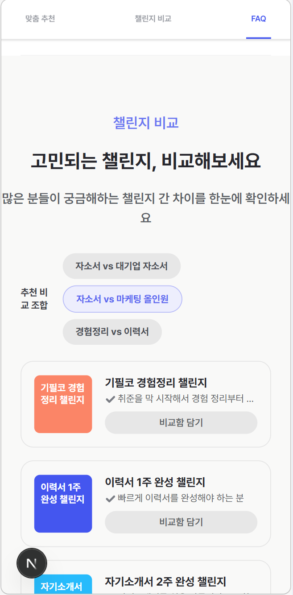
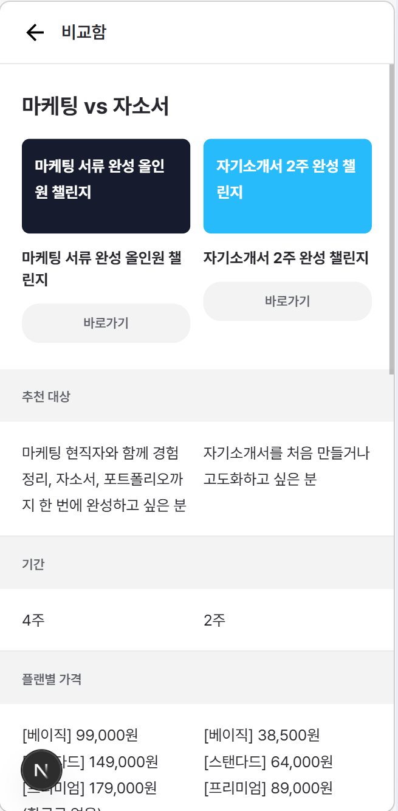

1. 비교함에 담기 이후 프로그램 2개 담기 버튼이 생김 이 프로그램 2개 비교하기는 FAQ가 보이기 시작하거나 나에게 맞는 프로그램 찾기가 보이면 보이지 않게 해야함
2. 이 프로그램 2개 비교하기를 클릭한 후 비교함으로 돌아가는 버튼을 클릭했을때 비교함에 담기 클릭했던게 모두 풀려야함
3. 챌린지 비교 부분 모바일 ui의 디자인이 기존 피그마 디자인과 많이 다르며 다른 자주묻는 질문과 나에게 맞는 프로그램 부분 디자인이 통일성이 부족함

---

1. 모바일에서 좌우 여백이 큐레이션, 첼린지 비교, 자주묻는 질문이 각각 다름
2. 모바일 큐레이션에서는 내가 진행한 정도에 따라서 1 상태선택, 2 오늘 상황 , 3 시간과 일정이 가운데 있도록 자동 스크롤하고 화살표 모양이랑 모바일 ui에 맞게 표시되도록 해줘
3. 모바일에서 추천조합 클릭하고 비교함에 나왔을때 보라색으로 버튼 색이 변경되는거 없에줘
4.  겔럭시 s8+ 360x740 이 사이즈에서 모바일 ui가 이상하게 보여 모바일 반응형을 최적화 해줘
5.  비교함에 들어갔을때 글자가 두줄이 되서 버튼의 위치가 달라지는 버그가 있어 글자를 한줄로 만들든 버튼 위치를 조정하든 해봐
